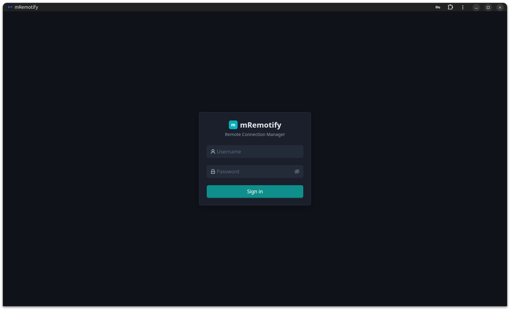
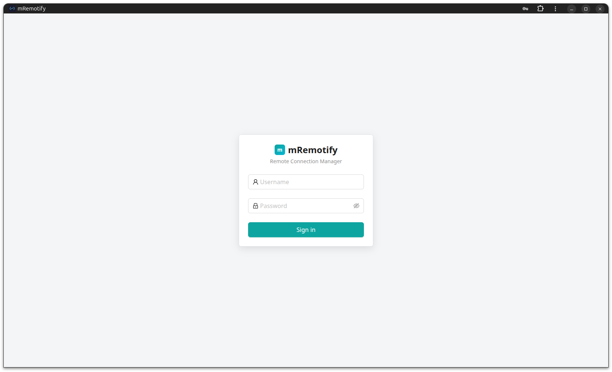
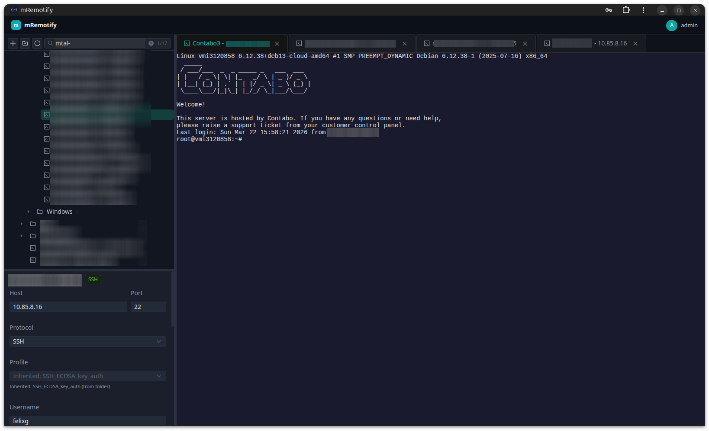
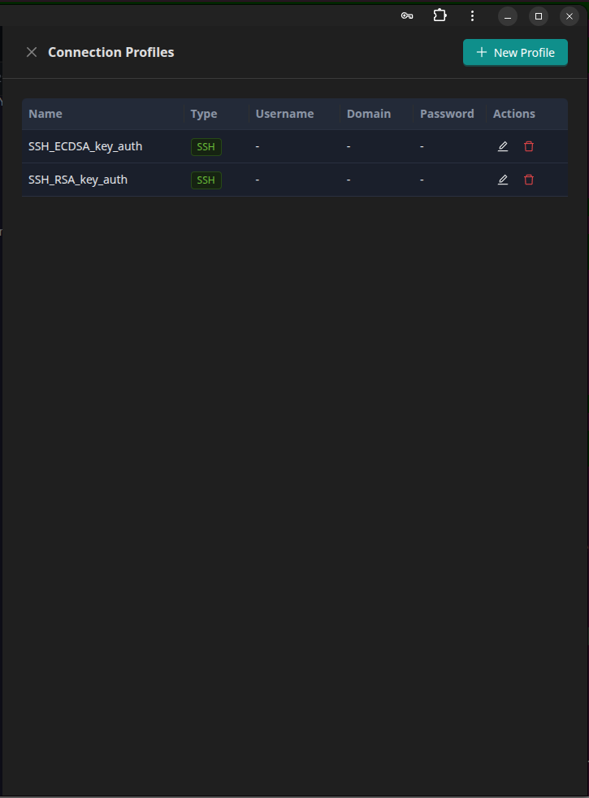
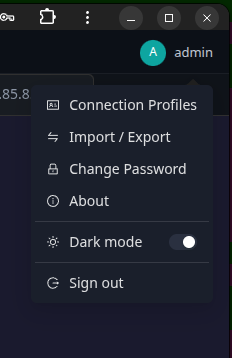

# mRemotify

Some time ago when Windows 11 came up, I got so annoyed with that OS and Microsoft.
I finally started to migrate also for work to Ubuntu. I needed a replacement for my mRemoteNG that was my main remote session manager.
So I decided to create my own. Right now, I wouldnt suggest to run it on a public facing VPS, just run it locally using docker compose and you are fine.

I've added a weired local network range to docker-compose.yml with static IPs for containers, so you can use the 10.255.255.250 in your host entry to get certificate and PWA working.

Enjoy.


Browser-based remote connection manager — open-source alternative to mRemoteNG.

Manage SSH and RDP connections through a web UI with a tree-based layout, tabbed sessions, and connection profiles.

## Stack

| Layer     | Tech                                            |
|-----------|-------------------------------------------------|
| Frontend  | React 18 · TypeScript · Vite · Ant Design 5     |
| Backend   | Fastify · TypeScript · Prisma · PostgreSQL      |
| SSH       | ssh2 (Node.js) proxied over WebSocket           |
| RDP       | rdpd (Rust) — Xvfb + xfreerdp3 + x11rb         |
| Auth      | JWT · bcryptjs · AES-256 encryption at rest     |
| Infra     | Docker Compose · pnpm workspaces                |

## Features

- **Connection tree** — folders with drag-and-drop, context menus, search
- **Tabbed sessions** — each connection opens in its own tab
- **SSH terminal** — xterm.js over WebSocket, resize support
- **RDP viewer** — canvas-based remote desktop via rdpd (JPEG frame streaming)
- **SFTP file browser** — browse, upload, download, rename, and delete files over SFTP
- **Connection profiles** — reusable credential templates (SSH or RDP specific), assigned per connection. Profile values act as defaults, connection-level values override.
- **Profile inheritance** — assign SSH/RDP profiles at the folder level; all connections in that folder and its subfolders inherit the profile automatically. Connections can override with a direct profile assignment.
- **Import / Export**
  - **mRemoteNG import** — import `confCons.xml` files directly, with full support for mRemoteNG's default and custom master password encryption (AES-256-GCM). Preview the import tree before committing.
  - **mRemotify backup & restore** — export all folders, connections, and profiles as an encrypted `.mrb` backup file (AES-256-GCM with PBKDF2 passphrase). Restore with merge or replace mode.
- **Encrypted storage** — passwords and private keys AES-256 encrypted at rest
- **JWT auth** — all API and WebSocket routes are login-protected
- **Built-in TLS** — serve HTTPS directly without an external reverse proxy; configured via environment variables
- **PWA installable** — install mRemotify as a standalone desktop app from the browser (requires HTTPS)

## Screenshots

| Login (dark) | Login (light) |
|:---:|:---:|
|  |  |

| SSH Session | Connection Profiles | User Menu |
|:---:|:---:|:---:|
|  |  |  |

## Quick start (Docker Compose)

```bash
git clone https://github.com/deadRabbit92/mRemotify.git
cd mremotify

cp .env.example .env
# Edit .env: set ENCRYPTION_KEY, JWT_SECRET, ADMIN_PASSWORD

docker compose up -d

open http://localhost
```

Default login: `admin` / `admin123` (set `ADMIN_USER` / `ADMIN_PASSWORD` in `.env` before first start).

> **Security note:** Always generate strong random values for `ENCRYPTION_KEY` and `JWT_SECRET` before running in production. Never commit your `.env` file to version control.

## Development

Prerequisites: Node.js >= 20, pnpm >= 9, PostgreSQL running locally.

```bash
pnpm install

cp .env.example .env
# Set POSTGRES_URL to your local DB

cd backend && npx prisma migrate dev && npx prisma db seed && cd ..

pnpm dev
```

Frontend dev server runs on http://localhost:5173 (proxies `/api` and `/ws` to backend).
Backend API runs on http://localhost:3000.

## Project structure

```
mremotify/
  frontend/           React + Vite SPA
    src/pages/settings/   Import/Export page
    src/components/import/ mRemoteNG import, backup export/restore UI
  backend/            Fastify API, WebSocket proxies, Prisma schema
    src/lib/            mremoteng-parser, backup-crypto
    src/routes/         REST API (auth, connections, folders, profiles, import, export)
  rdpd/               Rust RDP daemon (Xvfb + xfreerdp3, WebSocket on :7777)
  docker/             Dockerfiles + nginx config
  docker-compose.yml
  .env.example
```

## Environment variables

| Variable          | Description                                           |
|-------------------|-------------------------------------------------------|
| POSTGRES_USER     | PostgreSQL username (default: mremotify)              |
| POSTGRES_PASSWORD | PostgreSQL password (default: mremotify)              |
| POSTGRES_DB       | PostgreSQL database name (default: mremotify)         |
| POSTGRES_URL      | PostgreSQL connection string                          |
| ENCRYPTION_KEY    | Key for AES-256 encryption — must be 32 chars         |
| JWT_SECRET        | Secret for signing JWT tokens (required)              |
| ADMIN_USER        | Initial admin username                                |
| ADMIN_PASSWORD    | Initial admin password                                |
| RDPD_URL          | rdpd WebSocket URL (default: ws://rdpd:7777)          |
| PORT              | Backend port (default: 3000)                          |
| TLS_ENABLED       | Enable HTTPS on nginx (default: false)                |
| APP_HOSTNAME      | Hostname for nginx server_name (default: localhost)   |
| HTTP_PORT         | Host HTTP port (default: 80)                          |
| HTTPS_PORT        | Host HTTPS port (default: 443)                        |
| CERTS_DIR         | Host directory to mount at /certs (file-based TLS)    |
| TLS_CERT_FILE     | Path to TLS cert inside container (default: /certs/tls.crt) |
| TLS_KEY_FILE      | Path to TLS key inside container (default: /certs/tls.key)  |
| TLS_CERT_B64      | Base64-encoded TLS certificate PEM (inline option)    |
| TLS_KEY_B64       | Base64-encoded TLS private key PEM (inline option)    |

## Enabling HTTPS

mRemotify has built-in TLS support so it can serve HTTPS without an external reverse proxy. This is useful for PWA installability on direct installs.

### Option 1: Self-signed certificate (local/dev)

```bash
# Generate a self-signed cert
mkdir -p ~/mremotify-certs
openssl req -x509 -newkey rsa:4096 \
  -keyout ~/mremotify-certs/tls.key \
  -out ~/mremotify-certs/tls.crt \
  -days 365 -nodes -subj "/CN=localhost"

# Configure .env
TLS_ENABLED=true
APP_HOSTNAME=localhost
CERTS_DIR=~/mremotify-certs

docker compose up -d
# → https://localhost
```

### Option 2: Wildcard certificate via Let's Encrypt (recommended for LAN + PWA)

A wildcard certificate from Let's Encrypt gives you a **trusted** HTTPS setup on your local network — no browser warnings, and PWA install works out of the box. This requires a domain you control and a DNS provider that supports the DNS-01 challenge (Cloudflare, Route 53, etc.).

**1. Obtain the wildcard cert** using [certbot](https://certbot.eff.org/) with the DNS-01 challenge:

```bash
# Example using the Cloudflare DNS plugin
sudo certbot certonly \
  --dns-cloudflare \
  --dns-cloudflare-credentials ~/.secrets/cloudflare.ini \
  -d "*.example.com" \
  --preferred-challenges dns-01
```

This creates `/etc/letsencrypt/live/example.com/fullchain.pem` and `privkey.pem`, valid for any `*.example.com` subdomain.

**2. Copy the cert files** to a directory accessible by mRemotify:

```bash
mkdir -p ~/mremotify-certs
sudo cp /etc/letsencrypt/live/example.com/fullchain.pem ~/mremotify-certs/tls.pem
sudo cp /etc/letsencrypt/live/example.com/privkey.pem ~/mremotify-certs/tls.key
sudo chown $USER:$USER ~/mremotify-certs/*
```

**3. Add a local hosts entry** so the subdomain resolves to your LAN IP:

```bash
# /etc/hosts (Linux/macOS) or C:\Windows\System32\drivers\etc\hosts (Windows)
10.255.255.250  mremotify.example.com
```

Replace `10.255.255.250` is the static container IP of the mRemotify frontend.
That way this can stay static, but it will only work locally. Which is intended right now.

**4. Configure `.env`:**

```bash
TLS_ENABLED=true
APP_HOSTNAME=mremotify.example.com
CERTS_DIR=~/mremotify-certs
TLS_CERT_FILE=/certs/tls.pem
TLS_KEY_FILE=/certs/tls.key
```

```bash
docker compose up -d
# → https://mremotify.example.com  (trusted, PWA installable)
```

> **Why this works:** The browser sees a valid Let's Encrypt certificate for `*.example.com`, the hosts entry routes traffic to your LAN, and HTTPS satisfies the PWA secure-context requirement — so the install icon appears in the address bar.

> **Renewal:** Let's Encrypt certs expire after 90 days. Run `certbot renew` and copy the new files to your certs directory, then restart: `docker compose restart frontend`.

### Option 3: CA-issued certificate (internal CA, etc.)

Same flow as above — place your issued cert and key in a directory and point `CERTS_DIR` at it:

```bash
TLS_ENABLED=true
APP_HOSTNAME=mremotify.example.com
CERTS_DIR=/etc/ssl/mremotify
```

### Option 4: Behind a reverse proxy (HAProxy / Traefik / nginx)

Leave `TLS_ENABLED=false` (the default). The reverse proxy handles TLS termination and forwards plain HTTP to mRemotify on port 80. No changes needed.
